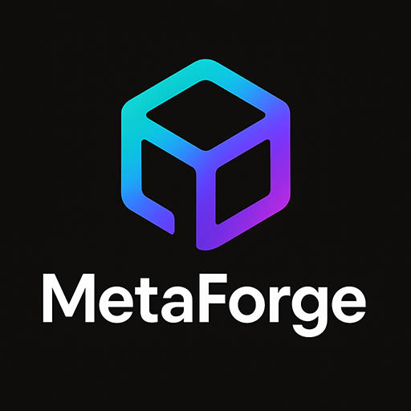

<p align="center">
  
</p>

<p align="center">
  <strong>Modern Metadata, Manifest & Asset Generator for Next.js</strong>
</p>

<p align="center">
MetaForge is a powerful all-in-one tool for generating <b>Next.js metadata</b>, <b>site.webmanifest</b>, <b>favicon sets</b>, <b>PWA icons</b>, and <b>OG preview images</b> using a simple visual interface.
Just upload a 512×512 base icon, choose your theme colors, fill metadata fields, and export! Perfect for <b>Next.js App Router</b> projects that need clean SEO, PWA assets, and consistent branding.
</p>

---

## ✨ Features

### 🖼️ Asset Generator  
- Upload a **512×512** PNG / JPG / SVG  
- Auto-generates all required icon sizes:
  - 16×16  
  - 32×32  
  - 48×48  
  - 64×64  
  - 96×96  
  - 128×128  
  - 180×180  
  - 192×192  
  - 256×256  
  - 384×384  
  - 512×512  
- Built-in **favicon preview**
- Built-in **Open Graph preview**
- Download:
  - Individual icons  
  - All icons at once  
  - Favicon  
  - OG image  

### 🧾 Metadata Generator  
Supports **every field in Next.js Metadata**, including:

- `title`, templates, absolute titles  
- `description`  
- `applicationName`  
- `authors`  
- `keywords`, `generator`, `publisher`  
- `robots` (string or object)  
- `icons`  
- `manifest`  
- `alternates`  
- `openGraph`  
- `twitter`  
- `appleWebApp`  
- `formatDetection`  
- `itunes`  
- `verification`  
- `appLinks`  
- plus all other advanced or deprecated fields

Outputs a **ready-to-paste TypeScript file** in full metadata format.

### 🎨 Theme Controls  
Users can pick:

- **Primary UI color**  
- **Accent color**  

Used globally inside the OG generator, UI previews, and metadata builder.

### ⚡ Instant Code Generation  
- Generates:
  - `metadata.ts`
  - `site.webmanifest`

Both based on user inputs + selected colors.


---

## 🛠️ Tech Stack

- **Next.js**
- **React**
- **TypeScript**
- **Tailwind CSS**
- **Framer Motion**
- **Lucide Icons**
- Client-side canvas image rendering for generating icons & OG images

---

## 🚀 Getting Started

### 1️⃣ Clone the repo

```bash
git clone https://github.com/imshawan/metaforge.git
cd metaforge

npm install
# or
yarn install
# or
pnpm install

npm run dev
```


